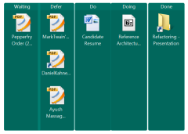
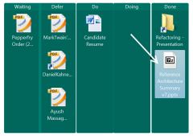

Personal Kanban on the desktop

I have been a GTD ([Getting Things Done](http://www.amazon.com/Getting-Things-Done-Stress-Free-Productivity/dp/0142000280)) fan as well as an agile practitioner for years. GTD advocates creating hard deadlines so that your slate is always clean. I have been finding this tough to manage as the WIP (work in progress) has been slowly increasing each day. [Personal Kanban](http://www.amazon.com/Personal-Kanban-Mapping-Work-Navigating/dp/1453802266) by Jim Benson and Tonianne DeMaria Barry provided a refreshing view.

---

## Fundamental Principles of Personal Kanban

The two fundamental principles that are harped upon are:

- **Principle 1: Visualize your work.** (When you can see your workload, you can understand it better)
- **Principle 2: Limit your WIP (work-in-progress). (**Don’t take on more work than you can handle)

In a nutshell:

To visualize work, one pins tasks in typically three swim-lanes – Ready, Doing and Done. Tasks need to be pulled from the Ready lane to Doing lane for execution and then moved off to Done lane after execution. The limit on WIP is set by limiting the tasks in the Doing lane.

## Implementing the visualization part

The visualization part was not very intuitive until I tried it out. One of the differences with GTD is visualization – since to-do lists do not really give one an aerial view of the work on plate. I have been using [StarDock Fences](http://www.stardock.com/products/fences/) to segregate my desktop icons into functionally separate areas. After trying a few lame searches to find a desktop tool, I decided to give it a try using Stardock Fences. Here’s the resultant desktop with five swim-lanes: Waiting, Defer, Do, Doing and Done.

| Before                                                       | After                                                        |
| ------------------------------------------------------------ | ------------------------------------------------------------ |
|  |  |

Nothing exciting so far :-(. I was using separate functional areas for the desktop icons anyways. The kicker :-) was when I moved the “Doing” task to “Done”. The empty Doing swim-lane gave a feeling of contentment. I then started looking at the desktop a bit more and realized that the visualization does indeed help. Here’s what the book says:

> **Kinesthetic Feedback 2: Pattern Recognition**
> Each time we move a sticky note, we receive kinesthetic feedback: the tactile action is both a data point and a reward. A regular succession of these movements creates a cadence, a rhythm of work. Cadence creates an expectation. We begin to notice patterns (types of tasks most often delayed, tasks that require additional help), make distinctions (what work we enjoy, who we enjoy working with), and can adjust our prioritizations to suit.

I am still working on this to see how the Limit WIP principle help, more updates later…Heavy stuff, but one needs to actually try it to see if it helps.

Tags: productivity, kanban, gtd
