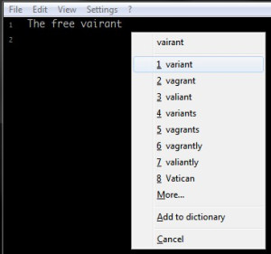
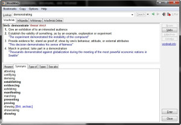
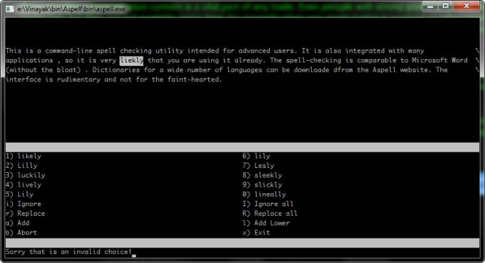

Proof reading and spell checking


Error proofing communication content is a vital part of any trade. Even people with strong grammar and spelling skills tend to make poor mistakes. Word processors like MS Word make help but they are not available every time, for example when one starts typing in notepad or other applications. You do not want to open an application which is slow to start and hogs memory just for doing a simple spell-check. The process of manual re-checking contents can be painful, however there are myriad of tools available that can make this process less laborious. Here’s a dash of such tools:

---


### 1) [TinySpell](http://tinyspell.numerit.com/)



The free variant is a tiny gem which beeps and pops up every time a mis-spelling occurs as you type on the fly. It can also check the clipboard contents.

The dictionary is configurable so that you can keep on adding words. It can be configured to ignore certain applications like programming IDE’s, games where spell-check is not useful. The beep can be annoying at times and can be disabled accordingly.

### 2) [WordWeb](http://wordweb.info/free/)



This free English thesaurus/dictionary pops up a dictionary definition of the highlighted word, often supplemented by a sample sentence demonstrating the correct usage of the word. This can be triggered by clicking the system tray icon or with the default keyboard shortcut CTRL+ALT+W. It also suggests items like synonyms, antonyms, and related words. It also shows the corresponding Wiki page – an important feature while researching anything.

### 3) [GNU Aspell](http://aspell.net/win32/)





This is a command-line spell checking utility intended for advanced users. It is also integrated with many applications , so it is very likely that you are using it already. The spell-checking is comparable to Microsoft Word (without the bloat) . Dictionaries for a wide number of languages can be downloaded from the Aspell website. The interface is rudimentary and not for the faint-hearted.

An [Autohotkey](http://www.autohotkey.com/) script that spell-checks the highlighted text in any item and replaces it with the spell-checked version is shown below (courtesy: MsgBox). The script copies the clipboard to a temporary text file, invokes Aspell to check this file and copies back the spell-checked text. The copied text removes all formatting, hence do not invoke this on formatted text like content copied from MS Word.

```shell
#z:: ; Spellcheck``  ``SoundBeep``  ``WinGet Id, Id, A``  ``Send ^c``  ``ClipWait 2``  ``TmpFile = %TEMP%\SpellCheckerTmp.txt``  ``FileDelete %TmpFile%``  ``FileAppend %Clipboard%, %TmpFile%``  ``RunWait ``"%MYBIN%\Aspell\bin\aspell.exe"` `check ``"%TEMP%\SpellCheckerTmp.txt"``  ``FileRead Clipboard, %TmpFile%``  ``WinActivate ahk_id %Id%``  ``WinWaitActive ahk_id %Id%``  ``Send ^``v``  ``return
```

### 4) Microsoft Speech API

This tool is a combination of a VB script (speak.vbs) and an [Autohotkey](http://www.autohotkey.com/) script to read out the highlighted text. This uses Microsoft Speech API that is typically installed on Windows 2000/XP and later. The VB script is tied to a hotkey in [Autohotkey](http://www.autohotkey.com/) and invoked using wscript to avoid the ugly command window popup.

Proof reading is the ultimate and final check – one can quickly spot out the remaining mistakes as the words are being read out.

###### Speak.vbs

```visual basic
' Speaks text passed on ``command` `line``Dim sapi``set` `sapi = CreateObject(``"sapi.spvoice"``)``sapi.Speak WScript.Arguments.Item(0)
```

```visual basic
^``#s:: ; Clipboard to speech`` ``Send, ^c`` ``clipboard = %clipboard%`` ``StringReplace, clipboard, clipboard, ",,All`` ``Run, wscript ``"%MYBIN%\speak.vbs"` `"%clipboard%"``,,MIN`` ``return
```

Tags: productivity, writing

